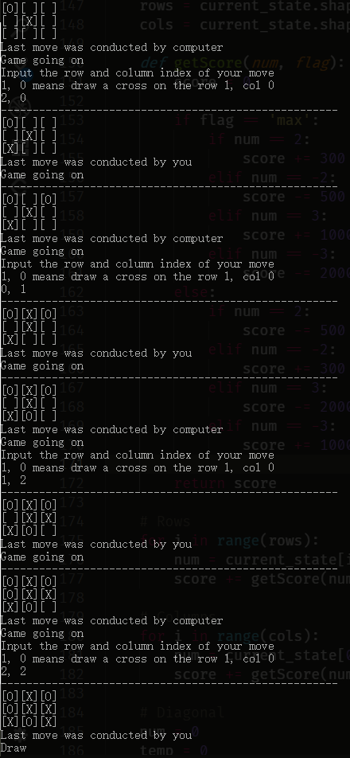
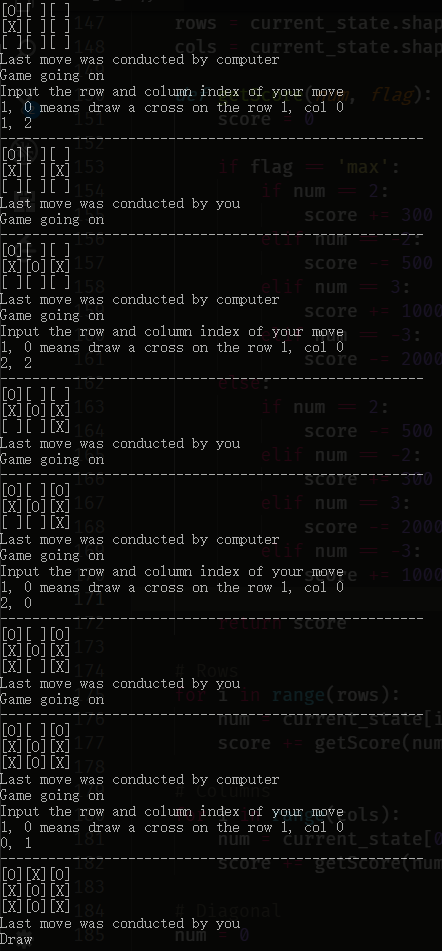

# Project 1 Solution

3160103838 Li Jiachen

---

## N-Puzzle Problem
### Prerequisite
* n_puzzle_state_main.py
* puzzle_state.py

The implementation of the game process is given. The main goal of the project is to determine several heuristic functions.

### Heuristics Design
To run the A* search algorithm, we need to define appropriate heuristics. Any possible heuristics should have following properties:

* Admissive (for tree search): $0 \le h(n) \le h^{*}(n)$
* Consistent (for graph search): $h(n) \le c(n, a, n') + h(n')$

where $h^{*}(n)$ is the true cost to a nearest goal and $c(n,a,n')$ is the cost of one transition from node $n$ to $n'$ via action $a$.

In the N-Puzzle problem, different states with particular position of each number can be considered as different nodes in a tree or a graph. We need to use some metrics to evaluate the "similarity" between the initial node and the goal node. All of the valid metrics can act as heuristics.

I developed 6 portential distance metrics as heuristics:
1. Euclidean distance
1. Position of the blank
1. Chebyshev distance
1. Hamming distance
1. Manhattan distance
1. Mixed method

### Insight
#### 1. Euclidean distance
The Euclidean distance is the first metric I realized.

The permutation of numbers can be seen as a certain point in a high-dimensional Euclidean space so that we can use a vector to represent a state.

For example, vector $\bold{g}=\begin{bmatrix}1&2&3&\dots&8&-1\end{bmatrix}^T$ stands for the state $\def\arraystretch{1.5}
   \begin{array}{c|c|c}
   1 & 2 & 3 \\
   \hline
   4 & 5 & 6 \\
   \hline
   7 & 8 & 
\end{array}$, where the numbers are extracted row-by-row into a column vector.

In this way, each state will refer to a point. Then we can calculate the Euclidean distance between two points like this:

For a certain state $\bold{s} = \begin{bmatrix}
s_1 & s_2 & \dots & s_N
\end{bmatrix}^T$ and a final state $\bold{g}= \begin{bmatrix}
g_1 & g_2 & \dots & g_N
\end{bmatrix}^T$ of a playboard of size $n$,

$$
h(\bold{s}) = ||\bold{s} - \bold{g}||_2
$$

where $h(\bold{s})$ is the heuristic function of state $\bold{s}$ and $N=n^2$.

This metric conforms with the requirement of a heuristic function. Because the Euclidean distance is always non-negative and in the Euclidean space it is always the closest distance.

#### 2. Position of the blank box
The Euclidean distance is available, but it works in a high dimension of $n^2$, where $n$ is the size of the playboard. Can we reduce the dimension so that we can calculate the distance with less effort?

The position of the blank can be used as a metric to help cut down the complexity of calculation.

We assume the playboard as a coordinate system with its origin (0,0) at the left-top box of the playboard like this example:

$$\def\arraystretch{1.5}
   \begin{array}{c|c|c}
   (0,0) & (0,1) & (0,2) \\
   \hline
   (1,0) & (1,1) & (1,2) \\
   \hline
   (2,0) & (2,1) & (2,2) 
\end{array}
$$

In this way, we can describe the position of the blank box via the coordinate system.

Since the boxes can only move vertically or horizontally, we use the Manhattan distance as a heuristic function to evaluate the state.

At the goal state, the blank box should be at the right-bottom corner of the playboard, thus we can define the heuristic function like this:

$$
h(x,y) = |x-x_g| + |y-y_g|
$$

where $(x,y)$ is the position of the blank box, $x_g=n-1$, $y_g=n-1$ and $n$ is the size of the playboard.

This definition also conforms with the requirement of a heuristic function, because the absolute value is always non-negative and the Manhattan distance is the closest in a vertical-and-horizontal-only moving pattern.

Obviously, compared with calculating Euclidean distance, this method is much more efficient in calculation.

#### 3. Chebyshev distance
Based on the coordinate system mentioned in last section, we can apply a new metric, the Chebyshev distance, as the heuristic function.

We define the heuristic function like this:
$$
h(x,y) = \max(|x-x_g|,|y-y_g|)
$$

where $(x,y)$ is the position of the blank box, $x_g=n-1$, $y_g=n-1$ and $n$ is the size of the playboard. This is called the Chebyshev distance between $(x,y)$ and $(x_g,y_g)$.

To prove its correctness, we use the conclusion of the Manhattan distance:

$$
h(x,y) = \max(|x-x_g|,|y-y_g|) < |x-x_g| + |y-y_g| \le h^*(x,y)
$$

where $h^*(x,y)$ is the true cost in the game.

Therefore, $h(x,y)$ can be used as a heuristic function.

#### 4. Hamming distance
This metric consider the playboard as a binary array. For each element in current state, except the blank box, this metric will check whether the element is at the same place with that in goal state. If they are at the same place, we get a 0, otherwise we get a 1. In this way, we finally convert the playboard into a binary array with 0 and 1 only. Sum up all the 1 in the array, then we get a number showing the total amount of misplaced boxes, except the blank box.

This metric must be heuristic because the amount of misplaced boxes must be non-negative and in a determined state, it must be a fixed value.

#### 5. Manhattan distance
This metric works in this way:

$$
h(n) = \sum_{i=0}^{K-1}||\bold{x}_i - \bold{x}_{ig}||_1,\space Value(\bold{x}_i)\neq-1
$$

where $\bold{x}_i$ is a two-dimension vector that illustrates the $i$th box's position, $\bold{x}_g$ is a two-dimension vector that illustrates the $i$th box's goal position, $K$ is the total amount of the boxes, and $Value(\bold{x}_i)$ means that the box value corresponds to vector $\bold{x}_i$.

The equation calculates the sum of Manhattan distance of all misplaced boxes on the playboard, except the blank box, acting as a heuristic function of state $n$. Since the Manhattan distance is a heuristic function in a vertically-and-horizontally-move-only environment, the sum of the Manhattan, thus, should be a available heuristic function as well.

#### 6. Mixed method
Just like what the title says, "mixed method" uses a bundle of methods together. It can contain any possible terms, combining in this way:

$$
h(n) = \sum_i^M \alpha_i h_i(n)
$$

where $M$ is the total amount of sub-heuristics, $\alpha_i$ is a weight coefficient, and $h_i(n)$ is the $i$th sub-heuristics.

The insight to sum them up stems from a thought that if one metric works, together work better.

In this project, we only use Metric 4 and 5 together as a mixed method. The implementation is very easy, since they performs pretty well in following performance tests. Parameters are setted like this:

$$
h(n) = 0.5h_{hamming}(n) + 0.5h_{manhattan}(n)
$$

This metric should be available, since the sum and multiplication operation are linear so that the linear combination of sub-heuristics will still be heuristic.

### Performance
In this section, let us evaluate the performance of aforementioned 6 heuristic functions.

When the initial state is fixed, Metric 2~6 usually work better than Metric 1, finding the shortest way to the goal state. Metric 1 can also find a way out but takes more steps.

For both testing samples of size of 3 and 4, if we set the initial move steps lower than 60, in most cases, all of the designs, evaluated by Metric 2&3 can find a solution in a reasonable time. If we set move steps much higher, however, such as 90 or 100, they work terriblely, meaning that they can hardly find a solution. In most cases, Metric 4~6 find a way out after a higher-than-90-step initial movement, which supports that these heuristic functions do work in solving the problem in complexer environments.

#### Which one to choose?
I did lots of experiments, testing the performance of those functions. However, it is quite hard for me to make a dicision, because the performance varies from time to time, possibly resulting from undetermined complexity of state space trees that are randomly generated in each test. But in general, some functions are better than others, such as Metric 4~6.

To choose a suitable function, I assume some naive premise. The Euclidean distance is calculated in a high dimensional space, which actually wastes lots of resources on float arithmetic operations. Comparing Metric 2&3, I believe that these two metrics are not convincing enough due to the exploitation of only one box on the playboard, though these two functions are less time-consuming than the Euclidean. Metric 4, which I consider as the best metric in this project, combines the less calculation with the use of information from all boxes. So, I prefer **Metric 4: Hamming distance** to be the final heuristic function.

At first, I predict that Metric 6, the mixed method, will perform much better. However, in experiments, it did not show any advancements than its components: Metric 4&5. That's why I give up choosing it to be the final function.

**Attention:** The code file contains all of the functions I designed. You can choose whichever you like to solve the problem. Just change the parameter `heuristics`. Here is a list of functions:

Name | Metric
---|---
'euclidean' (default) | Euclidean distance
'blank_pos' | Position of the blank box
'chebyshev' | Chebyshev distance
'hamming' | Hamming distance
'manhattan' | Manhattan distance
'mix' | Mixed method

---

## Tic-Tac-Toe Problem

In this section, we apply a Minimax search algorithm to solve a Tic-Tac-Toe problem. It performs pretty well, always achieving a tie if the human player does not make bad decisions deliberately. In other words, the AI never fails in the game.

### Prerequisite
* tic_tac_toe.py
* main_tic_tac_toe.py

### Rules
Before the algorithm design, let us determine some rules:
* AI plays "O", human plays "X"
* 1 stands for "O", -1 stands for "X"
* AI is the MAX user, human is the MIN user
* The depth of Minimax search is 3
* Human goes first

### Brief Process of the Algorithm
Particularly for the AI's decision process.
1. Find out all future states of current state
1. Evaluate the utility of each possible future state via **Depth-limited Minimax Search**
1. Achieve the future state where there is the largest utility

### Details
This part shows you how to implement a Minimax search algorithm with a given framework.

#### Important Functions
We have several important functions that need to be designed:

`get_available_actions(current_state)`: This function returns all available actions with a given state. Parameter `current_state` is a 3-by-3 numpy array, representing the current game state. Return value is `action_list`, a list of tuples storaging available actions.

`action_result(current_state, action, player)`: This function updates the game state with a certain action and a certain player. Parameter `current_state` stands for current game state; `action` is a tuple, standing for current action; `player` is an integer, standing for AI or human. Return value is a 3-by-3 numpy array, representing the next state after applying the action.

`min_value(current_state, depth)` and `max_value(current_state, depth)`: These functions are used to calculate the minimax value for each node in the search tree. Using which function depends on who the current user (AI or human) is. According to the rules, MAX for AI and MIN for human. Parameter `current_state` is the current game state; `depth` is the remaining search depth in the future. Return value is a integer, representing the minimax value of current state.

`utility(current_state, flag)`: This function calculates the utility of a state, acting as an evaluation of the game state (who is the most possible winner). Parameter `current_state` is the current game state; `flag` determines the user, because different users have different utility calculating methods. Return value is a integer, representing the utility.

For more details, please check codes.

#### Keep-in-mind
There are quite a few problems I met with during the design of the algorithm. Here I illustrate some typical members.

**1. Recursive calling**
To implement minimax value assignment for each state, each node must calculate its future nodes' values recursively. To guarantee a recursive export, we must import a parameter *depth* into the calculating process. After each epoch of recursions, *depth* subtracts 1 and acts as parameter of next recursive calculation. When the *depth* decreases to 0, it reaches the recursive export. Then we can consider the current state as the final state and start evaluation.

**2. Scoring function**
Scoring function evaluates the game state via current user type (AI or human) and chess information (chess type, position and number). The output of the scoring function is the utility value.

In general, we evaluate in two steps:
1. State check
1. Scoring

**State check**: We examine 8 possible routes: 3 rows, 3 columns and 2 diagonals. We can simply sum up the "chess values" (1 and -1) in each route to get an description implying which user is more advantageous. E.g. there are 2 "X" chesses and 1 blank space in the first row, so we get a check result of -1-1+0=-2 for the first row.

**Scoring**: We score the states via the check results route-by-route. Depending on different users, the state gets reward or punishment differently. Scoring rule is showed in this table (the score is initiated with 0):

User | Check result | Score
--- | --- | ---
AI (MAX) | 2 | +300
AI (MAX) | -2 | -500
AI (MAX) | 3 | +1000
AI (MAX) | -3 | -2000
Human (MIN) | 2 | -500
Human (MIN) | -2 | +300
Human (MIN) | 3 | -2000
Human (MIN) | -3 | +1000

In the scoring function, we use a flag to illutstate the user.

**4. Void action list solution**
Sometimes, the depth does not decrease to 0 but the state is at the final state (all spaces in the chess board are filled). In this case, the algorithm can only get a void action list. Therefore, if the action list is void, we start the recursive export and calculate the utility of current state.

### Performance
Sample 1:

Sample 2:
