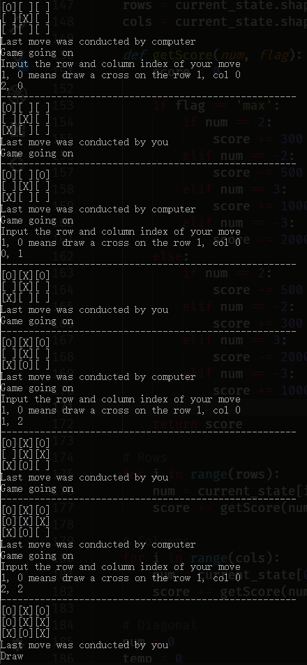
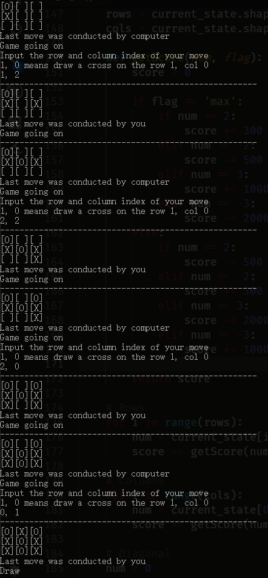

# Tic-Tac-Toe Problem Solution

<div align='right'>3160103838 Li Jiachen</div>

---


In this section, we apply a Minimax search algorithm to solve a Tic-Tac-Toe problem. It performs pretty well, always achieving a tie if the human player does not make bad decisions deliberately.

## Prerequisite
* tic_tac_toe.py
* main_tic_tac_toe.py
* Anaconda 4.4.10
    * Numpy 1.15.4
    * Python 3.6.4

## Usage
Enter the directory of `main_tic_tac_toe.py`, start your command line and input this command:

```bash
python main_tic_tac_toe.py
```

## Rules
Before the algorithm design, let us determine some rules:
* AI plays "O", human plays "X"
* 1 stands for "O", -1 stands for "X"
* AI is the MAX user, human is the MIN user
* The depth of Minimax search is 3
* Human goes first

## Brief Process of the Algorithm
Particularly for the AI's decision process.
1. Find out all future states of current state
1. Evaluate the utility of each possible future state via **Depth-limited Minimax Search**
1. Achieve the future state where there is the largest utility

## Details
This part shows you how to implement a Minimax search algorithm with a given framework.

### Important Functions
We have several important functions that need to be designed:

`get_available_actions(current_state)`: This function returns all available actions with a given state. Parameter `current_state` is a 3-by-3 numpy array, representing the current game state. Return value is `action_list`, a list of tuples storaging available actions.

`action_result(current_state, action, player)`: This function updates the game state with a certain action and a certain player. Parameter `current_state` stands for current game state; `action` is a tuple, standing for current action; `player` is an integer, standing for AI or human. Return value is a 3-by-3 numpy array, representing the next state after applying the action.

`min_value(current_state, depth)` and `max_value(current_state, depth)`: These functions are used to calculate the minimax value for each node in the search tree. Using which function depends on who the current user (AI or human) is. According to the rules, MAX for AI and MIN for human. Parameter `current_state` is the current game state; `depth` is the remaining search depth in the future. Return value is a integer, representing the minimax value of current state.

`utility(current_state, flag)`: This function calculates the utility of a state, acting as an evaluation of the game state (who is the most possible winner). Parameter `current_state` is the current game state; `flag` determines the user, because different users have different utility calculating methods. Return value is a integer, representing the utility.

For more details, please check codes.

### Keep-in-mind
There are quite a few problems I met with during the design of the algorithm. Here I illustrate some typical members.


**1. Recursive calling**
To implement minimax value assignment for each state, each node must calculate its future nodes' values recursively. To guarantee a recursive export, we must import a parameter *depth* into the calculating process. After each epoch of recursions, *depth* subtracts 1 and acts as parameter of next recursive calculation. When the *depth* decreases to 0, it reaches the recursive export. Then we can consider the current state as the final state and start evaluation.

**2. Scoring function**
Scoring function evaluates the game state via current user type (AI or human) and chess information (chess type, position and number). The output of the scoring function is the utility value.

In general, we evaluate in two steps:
1. State check
1. Scoring

**State check**: We examine 8 possible routes: 3 rows, 3 columns and 2 diagonals. We can simply sum up the "chess values" (1 and -1) in each route to get an description implying which user is more advantageous. E.g. there are 2 "X" chesses and 1 blank space in the first row, so we get a check result of -1-1+0=-2 for the first row.

**Scoring**: We score the states via the check results route-by-route. Depending on different users, the state gets reward or punishment differently. Scoring rule is showed in this table (the score is initiated with 0):

User | Check result | Score
--- | --- | ---
AI (MAX) | 2 | +300
AI (MAX) | -2 | -500
AI (MAX) | 3 | +1000
AI (MAX) | -3 | -2000
Human (MIN) | 2 | -500
Human (MIN) | -2 | +300
Human (MIN) | 3 | -2000
Human (MIN) | -3 | +1000

In the scoring function, we use a flag to illutstate the user.

**4. Void action list solution**
Sometimes, the depth does not decrease to 0 but the state is at the final state (all spaces in the chess board are filled). In this case, the algorithm can only get a void action list. Therefore, if the action list is void, we start the recursive export and calculate the utility of current state.

**5. Defensive strategy**
The algorithm runs in a defensive strategy, meaning that the AI always assumes that the human player tries his best to avoid failure and never makes bad decisions deliberately. Thus, the AI always makes decisions that prevent the human player from winning and is less likely to be aggressive. However, if the human player plays "stupidly", such as deliberately making a bad decision, the AI may be fooled, sometimes leading to a failure. I will show a case of the "fooled" AI in the following section. In other words, only if the human player tries his best to get rid of losing the game can the AI make reasonable responses.

## Performance
**Sample 1:** The human player tries his best to avoid failure. In this case, the AI will always get a draw.


**Sample 2:** The human player deliberately makes some bad decisions to "fool" the AI. If you do so, the AI may not perform reasonably.


